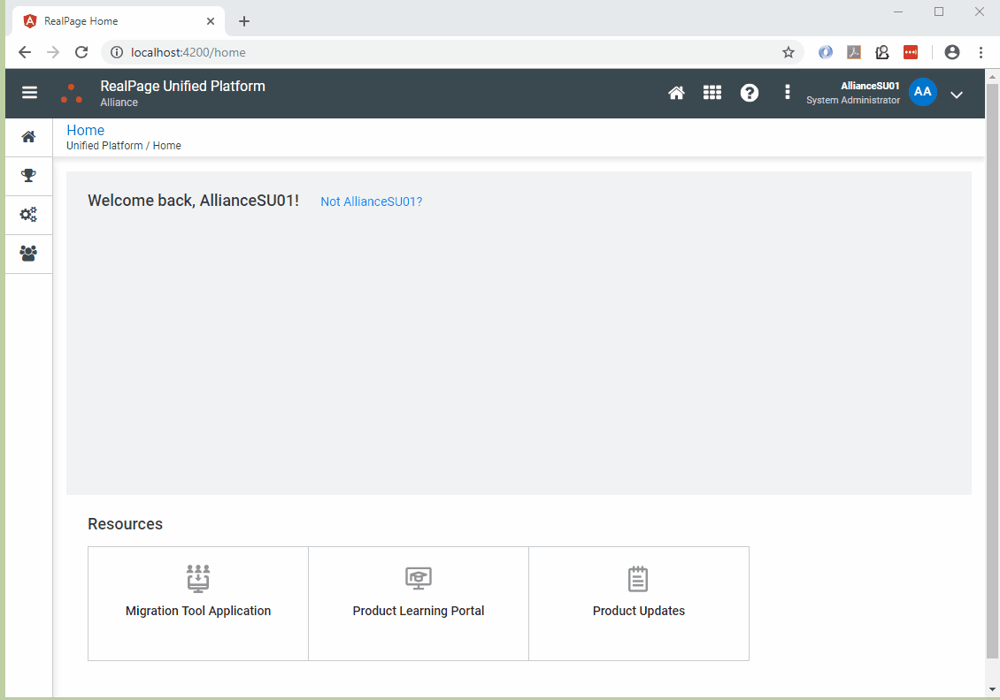

# Angular Starter

NOTE:  To contribute updates to this project, see the CONTRIBUTING.md document here in the starter repo.

This starter project has the following features:

- Built using Angular 17 (see below for standard Angular info)
- Includes Omnibar via the CDN
- Includes RAUL Angular NPM Package for UI Components and Utility classes (https://ui.realpage.com)
- Includes authentication via Unified Login
- Demonstrates "deep linking" -- i.e. go to ``/some-random-page`` as your first target and you will end up there after logging in.  Otherwise you end up at ``/home``.
- Sets RAUL page title as new components loaded
- Demonstrates authenticated API calls - and error handles them
- Includes logout and silent token renewal functionality
- Includes an "alert service" for pages to set alerts when wanted without needing new markup
- Includes ``Core`` and ``Shared`` modules as recommended by Angular style guide
- Includes ESLint and Prettier for code validation and format consistentcy
- Includes Husky to automatically running linting and unit tests during the commit/push process
- Uses Lazy Loading for Api Caller, Some-Random-Page, and Logout features

## Video Introductions

- [First Steps (02:25)](https://1drv.ms/v/s!Ag9btYE5Tg14r8coAuVbmsvp0oZgHw): Cloning the repo, copying to your own folder, running the application
- [What's in the box? (02:40)](https://1drv.ms/v/s!Ag9btYE5Tg14r8cpTia7xgXd3V1czQ): Demo of features shown by running the application
- [Code Walkthrough (10:42)](https://1drv.ms/v/s!Ag9btYE5Tg14r8cz4TFKogJAShdgSA): Brief discussion of the project itself by reviewing some of the code and the application structure
- [Next Steps (03:41)](https://1drv.ms/v/s!Ag9btYE5Tg14r8c09aJsrDdoFC7PdA): Creating a new page

## To try out and use the project

- Run ``npm install`` from the project directory
- Run ``ng serve`` from the project directory
- Use a web browser and browse to <http://localhost:4200>

NOTE: The config for the Unified Login integration is in the ``app.module.ts`` file (the bottom).

### Running Locally

Recommendation: Use [VS Code](https://code.visualstudio.com/).

Here are the minimum extensions you should probably have:

- Angular Language Service
- Debugger for Microsoft Edge (or Chrome)

### Debugging

The `.vscode/launch.json` file has been created with two launch configurations to support debugging with Microsoft Edge:

- `Attach with Debugger`: use this option to debug the application when you have already run (or plan to run) `ng serve` from the command line yourself
- `Run and Debug`: use this option to more completely run the `ng serve` command and launch the browser and debug all in one step

The above options will let you set breakpoints and review variables at runtime from within VS Code.

**N O T E:** If you want to use Chrome you will need to add similar options in `.vscode/launch.json` for Chrome instead of Edge.

Copy any/all of the files to get started with your own Angular project.

## Foundations

### Angular CLI

This application was built using the [Angular CLI](https://github.com/angular/angular-cli/wiki).  As such, `ng serve` is used to start the dev webserver, and other such commands are available that make development easier (adding npm packages, generating components or services or pipes, etc).  See the [documentation](https://github.com/angular/angular-cli/wiki) for information about the various available commands.

### Omnibar and RAUL

The Omnibar and RAUL are included via the CDN on the [`src/index.html`](./src/index.html) page both in the form of CSS files and the requires JS files.  

### OIDC-Client

[`oidc-client` is a JavaScript library](https://github.com/IdentityModel/oidc-client-js/wiki) to facilitate implicit flow authentication with an OpenID Connect / OAuth2 security service, which is what the Unified Platform provides.

## RAUL UI Shell

The `src/app.component` is what defines the RAUL UI shell and contains the overall layout of the application user interface.  The UI consists of five parts:

- "Omnibar" (the top navigation bar and overall shell of the app - this includes menus and such)
- Left Nav (`<omnibar-navigation>`)
- Page Header (`<header>`)
- Alert area (see below - only shows up if an alert has been triggered)
- Router outlet (main content area)

[Angular events](https://angular.io/api/core/EventEmitter) are used to set values on the Omnibar, page header, alert area, and left nav -- the subscribers are all in the `app.component.ts` file.

## Authentication

Authentication services are provided by `src/shared/auth.service.ts`, which puts a light wrapper on top of the `oidc-client` library.  The configuration is at the bottom of that file, and all values are fairly application-specific, and one value is **environment** specific (see Environments/Configuration below for more info).

### Sign In (with Deep Linking)

All pages in the application require an authenticated user, so the authentication check is during the load of the `app.component` code.

If the user is not authenticated, it will initiate the authentication process (via the `startAuthentication` method).  Before it does this it will check to see which URL the user was actually trying to access - if it's not the "home" page, then the target path is stored in HTML 5 session storage before the authentication process starts.

The authentication process redirects the user to the OpenID Connect / OAuth2 security token server.  Once the user completes the authentication process, they are sent back to the `auth-callback` component (as defined in the auth service).

The `auth-callback` component completes the sign in process and then checks session storage to see where the user should end up.

### Sign Out

Sign out is accomplished by the `logout` component.  For stopping impersonation some special logic is in place within this component (see below for more info).

## API calls

Authenticated, error handled API calls are made very simple.  Most can look like this:

    public getPersona() {    
        let apiUrl = environment.unifiedLoginApiRoot + "/persona";   
        return this.http.get(apiUrl);
    }

The above call actually includes both a bearer token for authentication and error handling on the back end of the call, even though there is no code surrounding the call to do this.  The is accomplished via two `HTTP_INTERCEPTORS`.

### Auth Interceptor

This is the `src/shared/auth.interceptor.ts` and it just adds the `access_token` obtained during either the login process or the Silent Renew process (see below) to the HTTP headers for ALL outgoing requests.

If custom logic based on the hostname or something is needed, it should be applied here.

### Handling Interceptor

The `src/shared/handling.interceptor.ts` grabs the response from an API call and does some error handling with it.  If it wasn't successful, it adds console log entries that indicate the API call that was made and the log location for the API errors for easy access as shown in the animation below.

It additionally triggers a UI alert which is the red box you see on the page using the Alert Service described further below.

**N O T E** If the API actually sends a response back that response could be evaluated and used here -- like an error id or things like that could be included in the Alert that is shown to the user.  The API that I was working with did not include this info.

## Environments / Configuration

Any environment-specific configuration values should be contained in the appropriately-named environment.ts file in the `src/environments` folder.  API base addresses, the Unified Login URL, and other such info would go into these files.

To add an environment, start by adding a new `environment.<newenvironment>.ts` file into the `src/environments` folder.  Copy the settings from `environment.ts`
and make the appropriate updates.

Then in the `angular.json` file, under `configurations` copy the `production` configuration and make sure to update the `fileReplacements` property to use
your new `environment.ts` file for the `with` value.  If you want to actually RUN against that new environment, you will have to add a new entry to the
`serve` element.

## Adding Pages

To add a new page to the application, the workflow is generally something like this:

- Use `ng generate component <newpagename>` to scaffold out the folder, files, and add the component to the `app.module.ts` file
- If you have an API service you will be communicating with for just this new page, use `ng generate service <servicename>` to generate the service
- Add a route for the new page on the `app-routing.module.ts` file
- Make sure that your new page is included in the left nav by adding it to the `app.service.ts` code (or the eventual API that it calls)

Then you should be able to log in to the application and navigate to the page that you just created.  

The rest is the markup and logic that you want to build.  Sky's the limit. :)

### Remove the CSS if you don't need it

If you don't need custom css for your new page, remove the referrence to it from the `component.ts` file and then delete the css file itself.  Add back only if needed.  This reduces the "noise" in the project.

### Setting the RAUL Page Header

In the `ngOnInit` method, you probably want to set the page title.  To do that, add a private property in the constructor with the `NewPageService`.

Then within `ngOnInit` just set the page title as follows:

    this.newPgSvc.setNewPage("Whatever You Want in the RAUL Page Header");

## Alerts

A general global alert capability is included.  This can show an alert to the user in the various format allowed within RAUL / Bootstrap.

To set one, inject the `AlertService` into wherever you want to set it from, and then call the `createAlert` method like the example below:

    this.alertSvc.createAlert({alertClass: "alert-error", alertMessage: "An error occurred during an API call!"});

The valid values for the `alertClass` are:

- `information`
- `warning`
- `success`
- `error`

## Building and Running

Building is done with the `ng build` command.  To build for specific environments, use `ng build --configuration <configname>`.

Running is done via `ng serve`.  To run a specific environment config, use `ng serve --configuration <configname>`.

## Setting up CI/CD in Azure DevOps

Setting up Continuous Integration (CI) and Continuous Delivery (CD) in Azure DevOps is pretty straight-forward and instructions and documentation can be found here:  <https://newwiki.realpage.com/display/DVO/Angular>
